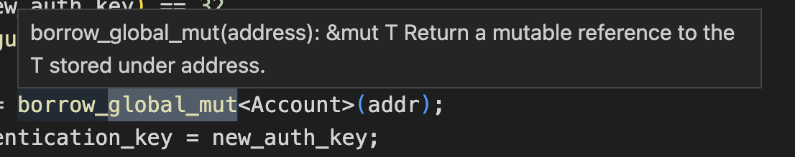

# 2022-12-30
增加use自动完成，支持move和msl语言。
~~~
module 0x2::xxx{}
module 0x2::yyy{
    use 0x2 /* 自动补全地址 包括地址和名字(比如std) */ ::xxx /* 补全地址下的所有模块 */ ; 
}
~~~
use模块成员。
~~~
module 0x2::xxx{
    struct XXX{} 
    fun aaa(){} 
}
module 0x2::yyy{
    use 0x2 /* 自动提示地址 */::xxx /* 提示模块 */ ::{ 
        Self, // 可补全关键字Self 
        XXX , // 补全结构体
        aaa   // 补全函数。
     }; 
}
~~~
friend自动完成。
~~~
module 0x2::xxx{}
module 0x2::yyy {   
    friend 0x2 /* 补全地址 */ ::xxx  /* 补全模块。 */;
}
~~~
move和msl类型自动完成
~~~
module 0x2::xxx { 
    use std::string;
    use std::string::String;
    fun some_fun(
        x : std /* 补全地址 */ ::string /* 补全模块 */::String /* 补全结构体 */, 
        y : string /* 补全引入的模块 */ :: String /* 补全结构体 */,
        z : String /* 补全String或者内置类型等。 */
    ) {
        
    }
}
~~~
泛型类型自动补全
~~~
module 0x2::xxxx{ 
    fun some_fun<TTT>(x : TTT) {
        some_fun<TTT /* 可自动补全泛型参数 */>();
    }
    struct Some<TTT> { x : vector<TTT /* 可自动补全泛型参数 */ > } 
}
~~~

# 2022-12-23
use 跳转到模块
~~~
module 0x2::xxx{}
module 0x2::yyy{
    use 0x2::xxx; // xxx跳转到定义。
    use 0x2::xxx as bbb; // bbb跳转到定义。
}
~~~
use 跳转到成员

~~~
module 0x2::xxx{
    struct X{} 
    fun a(){} 
}
module 0x2::yyy{
    use 0x2::xxx /* 跳转到模块定义 */ ::{ 
        Self /* 跳转到模块定义 */  as x /* 跳转到模块定义  */ , 
        X ,  // 跳转到结构定义
        a   // 跳转到函数定义  
     }; 
}
~~~

friend跳转到模块定义
~~~
module 0x2::xxx{}
module 0x2::yyy{   
    friend 0x2::xxx;  // xxx跳转到定义。
}
~~~

msl类型的跳转。
~~~
module 0x2::xxx{ 
    struct Account {}
    spec schema AccountContainsAddr {
        ... 
        let account_resource = global<Account /* 跳转到定义 */>(address);
        let account_resource = global<0x2::xxx /* 跳转到模块 */::Account /* 跳转到结构定义 */>(address);
        ...
    }

    spec create(x : Account /* 跳转到结构体 */) { 
        let y : Account /* 跳转到结构体 */ = ...;
    }
    spec create(x : 0x2::xxx /* 跳转到模块 */ ::Account /* 跳转到模块 */) { 
        let y : 0x2::xxx /* 跳转到模块 */ ::Account /* 跳转到模块 */;
    }
}
~~~

msl跳转到目标函数。
~~~
module 0x2::xxx{ 
    fun some_fun() {} 
    spec some_fun /* 跳转到函数定义 */() {}
}
~~~

msl跳转到结构体函数。
~~~
module 0x2::xxx{ 
    struct SOME() {} 
    spec SOME /* 跳转到函数定义 */() {}
}
~~~
msl跳转到函数参数和返回值
~~~
module 0x2::xxx {
    fun some_fun(x :u8 , y :u8) : (u8,u8){}
    spec some_fun { 
        let _x = x; // 跳转到参数 x 
        let _y = y; // 跳转到参数 y
        ensures result_1  /* 跳转到第一个结果 */ == result_2 /*  跳转到第二个结果 */;
    } 
}
~~~
msl跳转到结构体成员
~~~
module 0x2::xxx { 
    struct Some {x : u8 , y :u8 };
    spec Some {
        ...
        let _x = x; // 跳转到成员x
        let _y = y; // 跳转到成员y
        ...
    } 
}
~~~
msl表达式的跳转。
~~~
module 0x2::xxx {
    fun some_fun() {}
    spec some_fun() {
        let addr = ...;
        let add2 = addr;  // 跳转到addr。
        let addr3 = std::system_addr /* 跳转到模块 */::get_addr /* 跳转到函数定义 */();
        let addr4 = system_addr  /* 跳转到模块 */ :: get_addr() /* 跳转到函数定义 */;
    }
}
~~~

增加了一些spec内置函数的hover说明。

增加一些move内置函数的hover说明。

move语言表达式和类型新增支持跳转模块。
~~~
module 0x2::xxx { 
    fun some_fun(x : std::string /* 跳转到模块 */ ::String){
        let y = std::string /* 跳转到模块 */ ::empty();
    }
}
~~~

